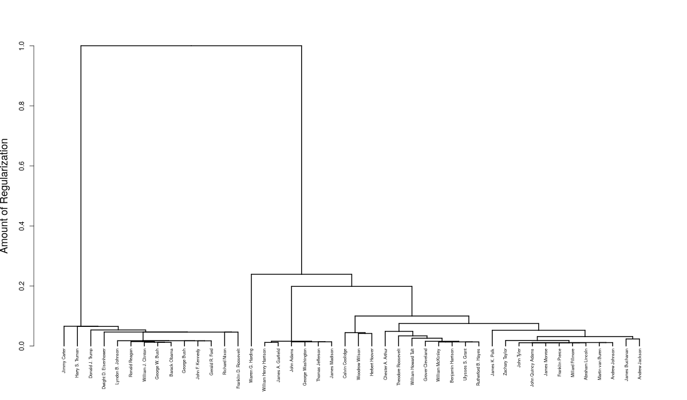

<!-- README.md is generated from README.Rmd. Please edit that file -->
clustRviz
=========

`clustRviz` aims to enable fast computation and easy visualization of Convex Clustering solution paths.

Installation
------------

You can install clustRviz from github with:

``` r
# install.packages("devtools")
devtools::install_github("jjn13/clustRviz")
```

Example
-------

Here is a quick example

``` r
library(clustRviz)
presidential_speech[1:5,1:5]
#>                     amount appropri  british     cent commerci
#> Abraham Lincoln   3.433987 2.397895 1.791759 2.564949 2.708050
#> Andrew Jackson    4.248495 4.663439 2.995732 1.945910 3.828641
#> Andrew Johnson    4.025352 3.091042 2.833213 3.332205 2.772589
#> Barack Obama      1.386294 0.000000 0.000000 1.386294 0.000000
#> Benjamin Harrison 4.060443 4.174387 2.302585 4.304065 3.663562
carp.fit <- CARP(presidential_speech)
#> Pre-computing weight-based edge sets
#> Computing CARP Path
#> Post-processing
carp.fit
#> CARP Fit Summary
#> Number of Observations: 44
#> Number of Variables: 75
#> Pre-processing: center
#> Weights: RBF Kernel, phi = 0.01, k = 4
#> Algorithm: CARP-VIZ
#> Visualizations: Static DendStatic PathInteractive Dend/Path
#> Raw Data:
#>                     amount appropri  british     cent commerci
#> Abraham Lincoln   3.433987 2.397895 1.791759 2.564949 2.708050
#> Andrew Jackson    4.248495 4.663439 2.995732 1.945910 3.828641
#> Andrew Johnson    4.025352 3.091042 2.833213 3.332205 2.772589
#> Barack Obama      1.386294 0.000000 0.000000 1.386294 0.000000
#> Benjamin Harrison 4.060443 4.174387 2.302585 4.304065 3.663562
```

 
